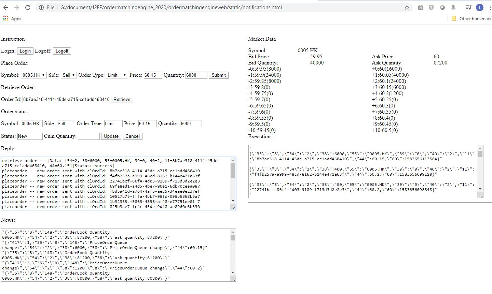
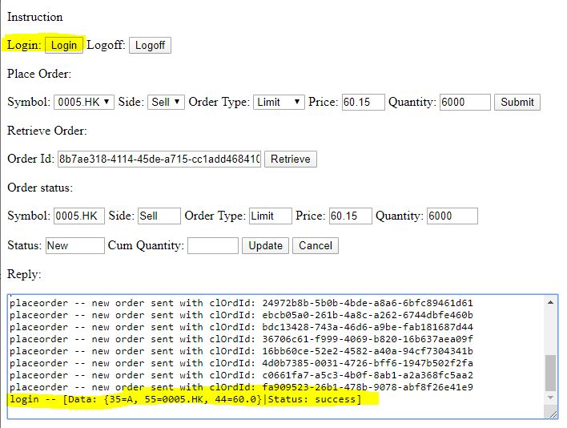
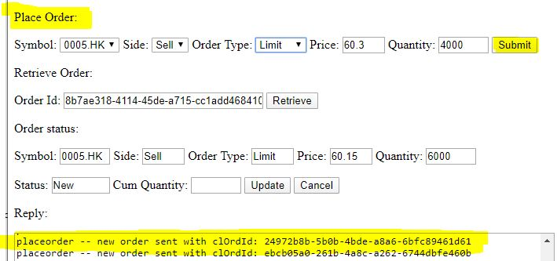
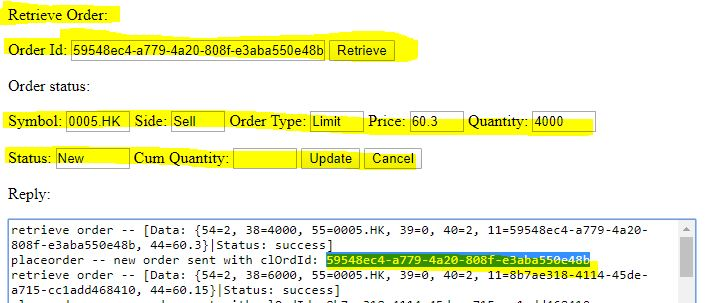
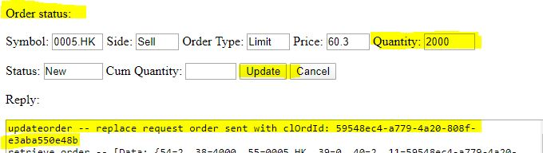
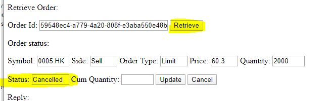

Order Matching Engine Web
=========================
This is a web component for:
   - providing rest api for login/logoff/place order/enquire order
   - controlling the core order matching engine lifecycle
   - publishing events via websocket

Tech Requirement
----------------
   - Java 1.8 or above
   - Maven 3
   - Spring boot (download via maven build)

Build
-----
Using maven to build/package. Can be run as basic java (>=1.8)
   - command for core order matching engine: mvn clean install
   - command: mvn package spring-boot:repackage
   - run: java -jar target/ordermatchingengineweb-1.0-SNAPSHOT.jar (simple)
   - run with gc: 
      - 1.8) java -XX:+UseG1GC -XX:+UseStringDeduplication -verbose:gc -XX:+PrintGCDateStamps -XX:+PrintGCTimeStamps -XX:+PrintReferenceGC -XX:+PrintGCDetails -Xloggc:logs/gc.log -jar target/ordermatchingengineweb-1.0-SNAPSHOT.jar
      - 1.9 or above) java -XX:+UseG1GC -XX:+UseStringDeduplication -verbose:gc -Xlog:gc*,ref*=debug:time,level,tags -XX:+PrintGCDetails -Xloggc:logs/gc.log -jar target/ordermatchingengineweb-1.0-SNAPSHOT.jar

User Interface
--------------

Login button with reply login successfully

Place Order and Confirmed by Pressing Submit button

Retrieve order. First pick the order id generated after order placed successfully at Reply console. Input it as Order Id and Press Retrieve button. Result will be shown at Order Status

Update order. After retrieving the order, change the Quantity value and press Update button.

Cancel order. After retrieving the order, press Cancel button. Retrieve the order again to see it cancelled

