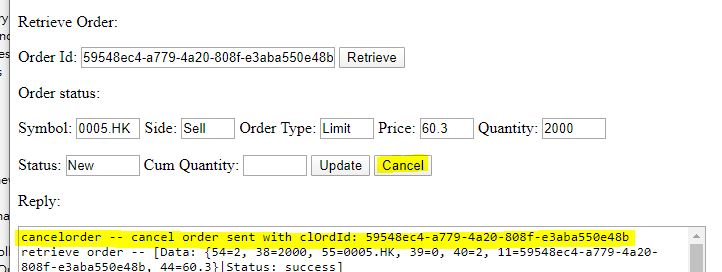
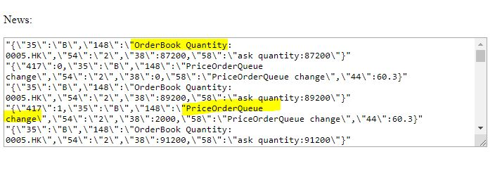
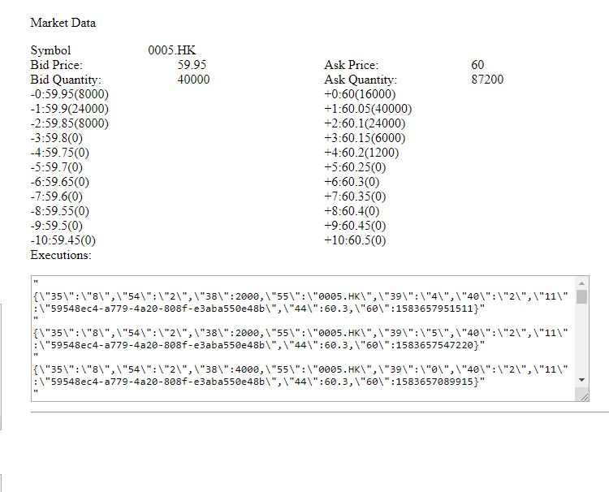
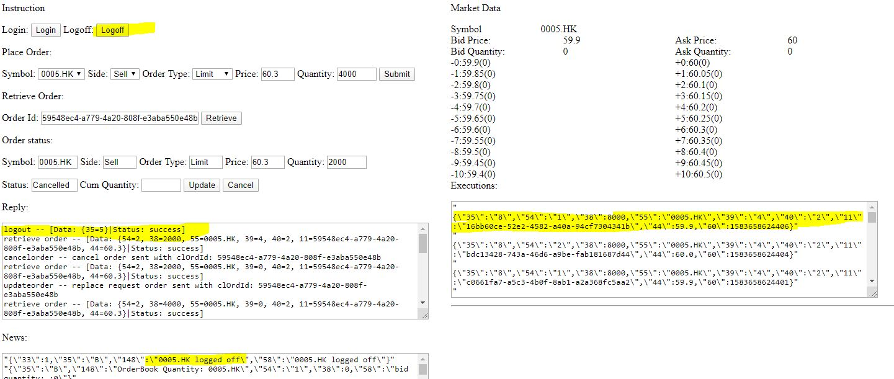

Order Matching Engine Web
=========================
This is a web component for:
   - providing rest api for login/logoff/place order/enquire order
   - controlling the core order matching engine lifecycle
   - publishing events via websocket

Tech Requirement
----------------
   - Java 1.8 or above
   - Maven 3
   - Spring boot (download via maven build)

Build
-----
Using maven to build/package. Can be run as basic java (>=1.8)
   - command for core order matching engine: mvn clean install
   - command: mvn package spring-boot:repackage
   - run: java -jar target/ordermatchingengineweb-1.0-SNAPSHOT.jar (simple)
   - run with gc: 
      - 1.8) java -XX:+UseG1GC -XX:+UseStringDeduplication -verbose:gc -XX:+PrintGCDateStamps -XX:+PrintGCTimeStamps -XX:+PrintReferenceGC -XX:+PrintGCDetails -Xloggc:logs/gc.log -jar target/ordermatchingengineweb-1.0-SNAPSHOT.jar
      - 1.9 or above) java -XX:+UseG1GC -XX:+UseStringDeduplication -verbose:gc -Xlog:gc*,ref*=debug:time,level,tags -XX:+PrintGCDetails -Xloggc:logs/gc.log -jar target/ordermatchingengineweb-1.0-SNAPSHOT.jar
   - if non-default port no to be used, we can use --server.port=<your port> appended to the command, e.g. --server.port=19999

User Interface
--------------
Usage: html file (notification.html)
for custom host/port, we can put notification.html?host=<host>&port=<port>
example: file:///C:/ordermatchingengineweb/static/notifications.html?port=19999

Login button with reply login successfully

Place Order and Confirmed by Pressing Submit button

Retrieve order. First pick the order id generated after order placed successfully at Reply console. Input it as Order Id and Press Retrieve button. Result will be shown at Order Status

Update order. After retrieving the order, change the Quantity value and press Update button.

Cancel order. After retrieving the order, press Cancel button. Retrieve the order again to see it cancelled

News. OrderBook Price/OrderBook Quantity/PriceOrderQueue change fix message with type news (Tag 35: B)
 

Market Data. Order Queues, bid/ask prices/quantities available at different spreads. The execution console displays the execution reports (Tag 35: 8)

Logoff. Press the Logoff button. Reply with logout message. News with logged off. Orderbook with outstanding orders removed and auto cancelled orders at New status or fully filled at partial filled state.

